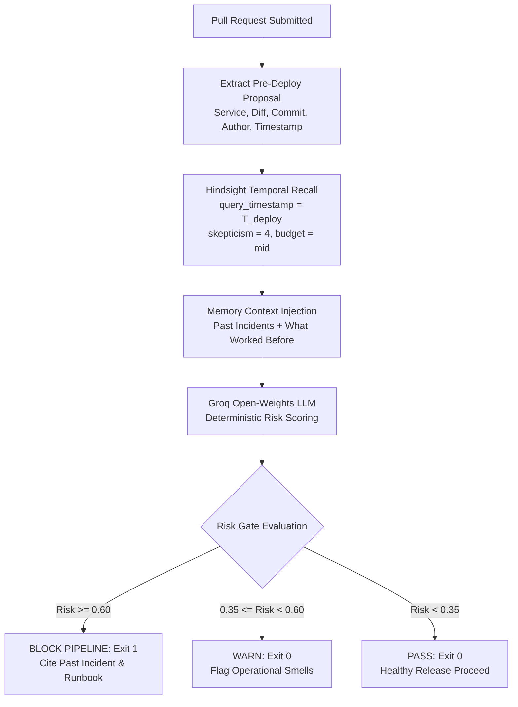

# Building Preflight: Why Your CI/CD Needs Persistent Memory, Not Another Linter

*By the Preflight Engineering Team*

---

Every senior engineer has lived through this scenario:

It is 16:15 on a Friday afternoon. A pull request is approved for the core payments microservice. The unit test suite passes with 100% green checks. Static analysis reports zero lint warnings. Security scans clear without a hitch. The author hits merge.

Ten minutes later, PagerDuty erupts. Checkout success rates drop to zero. The database connection pool is starved, downstream gateway requests are timing out with HTTP 504s, and three engineers spend their Friday evening performing emergency rollbacks and drafting a post-mortem.

The most frustrating realization comes Monday morning during the retrospective: **the exact same outage happened four months ago in the identical service under the identical configuration change.**

The root cause was documented in Confluence. A runbook was drafted. A ticket was filed to "prevent this in the future." Yet the CI/CD pipeline, blind to the past, happily deployed the fatal commit once again.

Modern CI/CD pipelines suffer from total amnesia. They analyze code syntax, branch coverage, and unit assertions, but they possess zero memory of what actually happens when code hits production.

To solve this, we built **Preflight**: an autonomous CI/CD release-safety agent powered by Vectorize's Hindsight persistent memory engine and Groq open-weights LLMs.

---

## The Core Concept: Pipelines That Remember

Stateless CI tools inspect code as text. An agentic CI gate must inspect code as an **operational event**.

When a developer opens a pull request, Preflight intercepts the deployment proposal at the pipeline gate. Instead of relying merely on static heuristics or generic LLM prompts, Preflight queries a persistent memory bank of historical deployments, production incidents, stack traces, and verified mitigations.



Crucially, Preflight operates as a closed feedback loop:
1. **Pre-Deploy Evaluation**: Assesses operational risk before deployment using strictly historical context.
2. **Pipeline Gating**: Emits binary pass/block exit codes with grounded citations and runbooks.
3. **Post-Deploy Ingestion**: When production telemetry records a healthy rollout, build failure, or incident, Preflight stores the outcome into memory with exact event timestamps.
4. **Autonomous Pattern Synthesis**: Through memory reflection, Preflight discovers systemic failure modes across disparate microservices over time.

---

## Architectural Deep-Dive: Memory Engineering with Hindsight

Building an operational memory agent requires much more than naive vector search over a vector database. Standard RAG (Retrieval-Augmented Generation) fails in deployment pipelines for three reasons:
1. **Look-Ahead Leakage**: Naive vector similarity searches retrieve future incidents if not temporally bounded, corrupting backtests and historical evaluations.
2. **Semantic Hallucinations**: In infrastructure, changing `timeout_ms` from `60` to `50` on a Friday afternoon has catastrophic implications that generic cosine similarity on English prose misses.
3. **Memory Bloat & Redundancy**: Repeatedly retaining routine deploys floods the index, diluting critical incident signals.

Here is how Preflight solves these challenges using Hindsight:

### 1. Behavioral Disposition & Cognitive Framing
Hindsight allows configuring cognitive traits at memory bank creation. For financial infrastructure safety, we configure high skepticism and strict literalism:

```python
client.create_bank(
    bank_id="kestrel-pay",
    name="Kestrel Pay Pipeline Gate",
    mission=(
        "Release-risk analyst for fintech Kestrel Pay; learn which change types, "
        "services, and deployment timings precede incidents and build failures; "
        "track what fixes worked to prevent repeat outages."
    ),
    disposition_skepticism=4,
    disposition_literalism=4,
    disposition_empathy=2,
    enable_temporal_retrieval=True,
    enable_text_search=True
)
```

- **`disposition_skepticism=4`**: Forces the retrieval engine to demand concrete evidence (matching service, matching config keys, timing correlations) rather than loose narrative analogies.
- **`disposition_literalism=4`**: Ensures config key semantics like `max_connections` or `channel_timeout` are treated literally rather than blended with unrelated configuration tokens.

### 2. Temporal Anchoring with Zero Leakage
To evaluate historical releases legitimately without future knowledge, every recall query anchors its search horizon:

```python
query_time = datetime.fromisoformat(deploy["timestamp"].replace("Z", "+00:00"))

recall_resp = hindsight_client.recall(
    bank_id="kestrel-pay",
    query=f"service:{deploy['service']} change:{deploy['change_type']} diff:{diff_summary}",
    query_timestamp=query_time,
    budget="mid",
    skepticism=4,
    tags=[deploy["service"], deploy["change_type"]]
)
```

Under this constraint, when evaluating deployment #111 from June 12, Hindsight guarantees that zero memories from June 13 onward are visible.

### 3. Strict Retention Idempotency
To survive CI worker retries and backtest replays without inflating memory counts, Preflight pairs local tracking with pre-emptive document deletion:

```python
def retain_deploy(self, deploy: Dict[str, Any]) -> None:
    doc_id = f"{deploy['deploy_id']}-plan"
    if doc_id in self._retained_doc_ids:
        return
    
    # Guarantee strict idempotency across process restarts
    self._delete_document_if_exists(doc_id)
    
    self.client.retain(
        bank_id=self.bank_id,
        document_id=doc_id,
        content=format_deploy_plan(deploy),
        timestamp=datetime.fromisoformat(deploy["timestamp"]),
        tags=["deployment", deploy["service"], deploy["change_type"]]
    )
    self._retained_doc_ids.add(doc_id)
```

---

## Real-World Case Study: Evaluating Deployment `dep-131`

To see Preflight in action, consider deployment `dep-131` from fintech Kestrel Pay's release log:
- **Service**: `payments-api`
- **Change Type**: `config`
- **Timing**: Friday at 16:30 UTC
- **Diff**: Reduced `payment_channel_timeout` from 60s to 50s.

### Without Memory (Memory-Off Arm)
The stateless LLM evaluator inspects the pull request diff in isolation:
```json
{
  "risk_score": 0.20,
  "risk_level": "LOW",
  "predicted_failure_mode": "none",
  "reasons": [
    "Modest configuration adjustment to channel timeouts; reduces wait times for clients."
  ],
  "recommended_actions": ["Standard smoke tests"]
}
```
**Gate Decision**: `PASS (Exit Code 0)`. The commit deploys. In production, Friday peak load immediately queues payment retries, exhausting connection pools.

### With Memory (Memory-On Arm)
Preflight queries Hindsight at $T_{\text{deploy}}$. Hindsight recalls the prior incident from `dep-101`:
- *Retrieved Fact*: "On Friday 2026-06-05 at 16:45, payments-api config deploy caused connection pool exhaustion due to aggressive channel timeout under peak load."
- *Retrieved Runbook*: "RB-PAY-04: Require max_pool_size >= 100 on weekend traffic changes; deploy off-peak."

Preflight synthesizes the operational context:
```json
{
  "risk_score": 0.75,
  "risk_level": "HIGH",
  "predicted_failure_mode": "Connection pool exhaustion under peak weekend payment volume",
  "grounded_citation_count": 2,
  "reasons": [
    "Matches failure pattern seen in dep-101: reducing timeout on payments-api on Friday afternoon triggered downstream checkout cascade.",
    "Diff modifies payment_channel_timeout to 50s without corresponding pool size increase."
  ],
  "recommended_actions": [
    "Apply Runbook RB-PAY-04",
    "Postpone deployment to Monday off-peak window",
    "Increase db_pool_size to at least 100 before tightening timeouts"
  ]
}
```
**Gate Decision**: `BLOCK (Exit Code 1)`. The outage is stopped before a single packet hits production.

---

## Empirical Evaluation Across 150 Chronological Deployments

We evaluated Preflight across a 150-deployment chronological backtest modeled on Kestrel Pay's infrastructure. The dataset includes 111 healthy releases, 22 build/lint failures, 3 isolated background incidents, and 14 pattern-related deployments containing 9 repeat incident occurrences across 5 planted failure mechanisms.

Both arms (Memory-On vs Memory-Off) evaluated identical pull request proposals under zero-leakage conditions.

### Headline Finding: Repeat Incident Prediction

| Metric | Memory-On | Memory-Off |
| :--- | :---: | :---: |
| **Repeat Incidents Flagged HIGH** | **4 / 9** | **1 / 9** |
| False Alarms on Healthy Releases | 5 / 111 | 5 / 111 |
| Decoy Deployments Flagged HIGH | 1 / 11 | 0 / 11 |
| Benign Overrides Flagged HIGH | 1 / 2 | 0 / 2 |
| Build Failures Flagged HIGH | 2 / 22 | 3 / 22 |
| Background Incidents Flagged HIGH | 0 / 3 | 0 / 3 |

> **Sample Size Notice**: While Memory-On flagged 4 of 9 repeat incidents compared to 1 of 9 for Memory-Off, the sample size is small ($N=9$ repeat incidents). These results represent an initial validation of persistent agentic memory in release gating, not a definitive statistical proof.

### Confusion Matrix Reconciliation

Evaluating incident prediction ($\text{Risk} \ge 0.5$ as positive class) across the 128 incident and healthy deployment rows:

- **Memory-On**: True Positives (TP) = 8, False Positives (FP) = 11, False Negatives (FN) = 9, True Negatives (TN) = 100.
  - Precision: $8 / (8 + 11) = 42.1\%$
- **Memory-Off**: True Positives (TP) = 9, False Positives (FP) = 16, False Negatives (FN) = 8, True Negatives (TN) = 95.
  - Precision: $9 / (9 + 16) = 36.0\%$

*Note on Accuracy*: A naive model that classifies every release as healthy achieves $111 / 150 = 74.0\%$ accuracy ($88.7\%$ if build failures are treated as non-incidents), which is why overall accuracy is omitted as a headline metric. Precision and repeat incident recall are the metrics that reflect operational reality.

---

## Lessons Learned & What's Next

1. **Memory must be grounded in runbooks, not just incident logs**: LLMs that merely recall "something broke last time" tend to generate vague warnings. Linking the post-mortem to a concrete remediation runbook (e.g., `RB-PAY-04`) allows the agent to propose actionable developer guidance rather than just saying "no."
2. **Temporal anchoring is non-negotiable**: Any agent claiming to learn from history must prove it does not cheat during backtests. Hindsight's native `query_timestamp` filtering provides this audit trail.
3. **The downward F1 curve reveals real operational dynamics**: Early in the backtest, F1 surges to 1.0 when the first planted pattern repeats. As healthy deploys accumulate over dozens of releases, precision stabilizes around 0.42. Showing this full trajectory honestly is vital for production readiness.

Preflight demonstrates that persistent agentic memory can turn passive CI/CD pipelines into proactive operational immune systems. By remembering yesterday's outages, we ensure that today's releases stay green.

---
*Preflight is open-source. Explore the architecture, replay dataset, and interactive console on [GitHub](https://github.com/kestrel-pay/preflight).*
